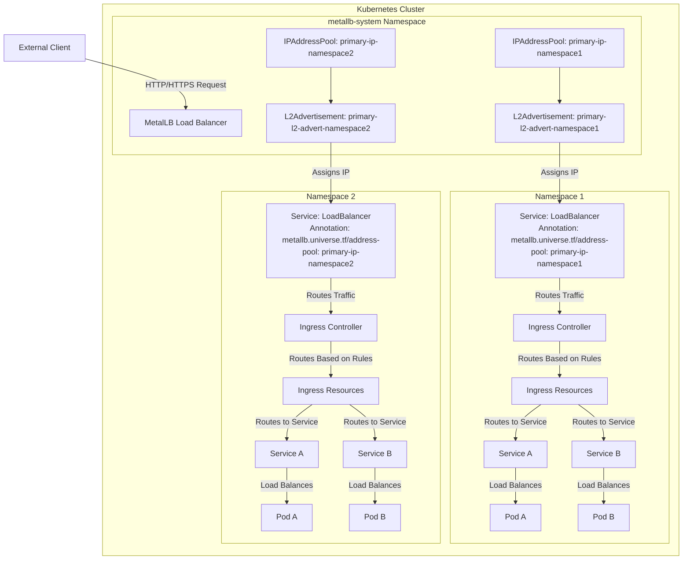

# Kubernetes Architecture: MetalLB to Ingress to Pods

This diagram illustrates the flow of traffic from external clients through the MetalLB load balancer, to the Ingress controller, and finally to the application pods. It also shows the multi-namespace isolation concept.

## Multi-Namespace Isolation

This architecture provides complete isolation between namespaces:

1. **MetalLB Resources in metallb-system**:
   - IPAddressPool and L2Advertisement resources are created in the `metallb-system` namespace
   - Resources are named with the namespace (e.g., `primary-ip-namespace1`) to avoid conflicts
   - Each namespace's resources are independent of other namespaces

2. **LoadBalancer Services**:
   - Each namespace has its own LoadBalancer services
   - Services reference the corresponding MetalLB resources using annotations
   - Each service gets its own external IP address from its designated pool

3. **Ingress Controllers**:
   - Each namespace has its own Ingress Controller deployment
   - Controllers are isolated and don't interfere with each other
   - Each controller handles only the traffic for its namespace

4. **Ingress Resources**:
   - Ingress resources are namespace-scoped
   - They define routing rules for HTTP/HTTPS traffic within their namespace
   - They can't affect resources in other namespaces

5. **Services and Pods**:
   - Services and pods are namespace-scoped
   - They can only communicate with other resources in the same namespace (unless explicitly allowed)
   - This provides security isolation between different environments

## Traffic Flow

1. **External Client to MetalLB**:
   - Client sends HTTP/HTTPS request to the external IP address
   - MetalLB receives the request and forwards it to the appropriate LoadBalancer service

2. **LoadBalancer to Ingress Controller**:
   - LoadBalancer service routes traffic to the Ingress Controller pods
   - Traffic is kept within the namespace

3. **Ingress Controller to Services**:
   - Ingress Controller examines the HTTP/HTTPS request
   - Based on Ingress rules, it routes the request to the appropriate Service
   - URL paths and hostnames determine which Service receives the request

4. **Services to Pods**:
   - Service load balances traffic across available Pods
   - Pods process the request and generate a response
   - Response follows the reverse path back to the client

## Implementation Details

- **MetalLB Configuration**:
  - MetalLB is installed cluster-wide in the `metallb-system` namespace
  - IPAddressPool resources define the available IP addresses for each namespace
  - L2Advertisement resources announce these IPs on the network

- **Helm Chart Implementation**:
  - The ingress chart creates MetalLB resources in the `metallb-system` namespace
  - Resources are named with the namespace to avoid conflicts
  - LoadBalancer services reference these resources using annotations
  - The `--skip-crds` flag is used when installing to avoid CRD ownership conflicts
