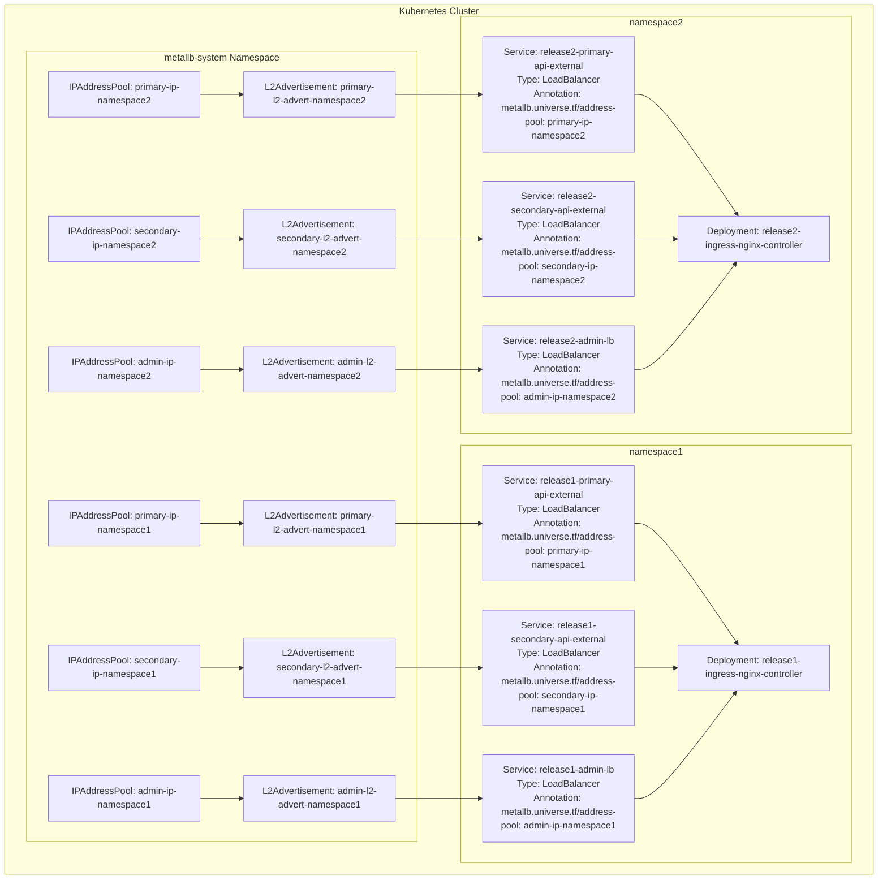

# Detailed Architecture Diagram: MetalLB Integration

This document provides a detailed architecture diagram showing how the ingress chart integrates with MetalLB.



## Architecture Explanation

### MetalLB Resources in metallb-system Namespace

All MetalLB resources (IPAddressPool and L2Advertisement) are created in the `metallb-system` namespace, as required by MetalLB's admission webhook. However, they are named with the namespace of the release to avoid conflicts:

- `primary-ip-namespace1` for the primary API in namespace1
- `secondary-ip-namespace1` for the secondary API in namespace1
- `admin-ip-namespace1` for the admin API in namespace1

And similarly for namespace2.

### Services in Release Namespaces

Services are created in their respective release namespaces, but they reference the MetalLB resources in the `metallb-system` namespace using annotations:

```yaml
metallb.universe.tf/address-pool: primary-ip-namespace1
```

This allows multiple releases in different namespaces to use MetalLB without conflicts, while respecting MetalLB's requirement that its resources be created in the `metallb-system` namespace.

### Ingress Controllers

Each release has its own ingress controller deployment, which is referenced by the services in that namespace. This allows for complete isolation between releases, with each having its own set of load balancers and ingress controllers.

## Multi-Namespace Deployment

This architecture supports deploying the chart in multiple namespaces without conflicts:

1. Each namespace gets its own set of MetalLB resources in the `metallb-system` namespace, with namespace-specific names
2. Each namespace gets its own set of services that reference the corresponding MetalLB resources
3. Each namespace gets its own ingress controller deployment

This approach provides complete isolation between releases while respecting MetalLB's requirements.
