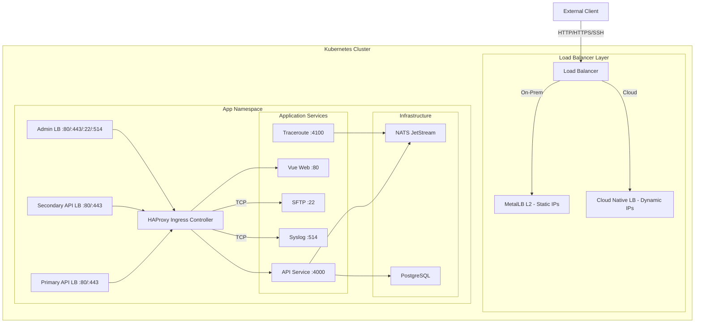

# Installing Call Telemetry with HAProxy Ingress Controller

Complete installation guide for deploying Call Telemetry on Kubernetes using HAProxy as the ingress controller. Supports on-prem (K3s/bare metal), DigitalOcean, AWS EKS, and Azure AKS.

## Prerequisites

- Kubernetes cluster (v1.30+)
- Helm v3+ installed
- `kubectl` configured to communicate with your cluster

```bash
# K3s — copy kubeconfig
mkdir -p ~/.kube
sudo cat /etc/rancher/k3s/k3s.yaml > ~/.kube/config
```

### Cloud-Specific Prerequisites

| Platform | Additional Requirements |
|----------|----------------------|
| **DigitalOcean** | DOKS cluster provisioned |
| **AWS EKS** | [AWS Load Balancer Controller](https://docs.aws.amazon.com/eks/latest/userguide/aws-load-balancer-controller.html), [EBS CSI Driver](https://docs.aws.amazon.com/eks/latest/userguide/ebs-csi.html) |
| **Azure AKS** | AKS cluster with managed identity |

## Architecture Overview



### Components

| Component | Purpose |
|-----------|---------|
| **MetalLB** | Layer 2 load balancer for bare metal (on-prem only) |
| **HAProxy Ingress** | Routes external traffic to services, handles TCP passthrough |
| **NATS** | JetStream messaging for inter-service communication |
| **PostgreSQL** | Data storage (CNPG or Crunchy PGO) |
| **API** | CallTelemetry core application |
| **Vue Web** | Frontend user interface |
| **Traceroute** | Network diagnostics service |

### Port Mapping

| Load Balancer | Port | Destination |
|--------------|------|-------------|
| Primary API | 80, 443 | HAProxy → API (policy endpoints) |
| Secondary API | 80, 443 | HAProxy → API (data endpoints) |
| Admin | 80, 443 | HAProxy → API + Vue Web |
| Admin | 22 | HAProxy → SFTP (TCP passthrough) |
| Admin | 514 | HAProxy → Syslog (TCP passthrough) |

## Quick Start (Helmfile)

The fastest path. Helmfile handles ordering, dependencies, and RBAC automatically.

```bash
# Install helmfile
brew install helmfile  # macOS
# Linux: curl -L https://github.com/helmfile/helmfile/releases/latest/download/helmfile_linux_amd64 > /usr/local/bin/helmfile

# Install helm-diff plugin
helm plugin install https://github.com/databus23/helm-diff

# Clone and deploy
git clone https://github.com/calltelemetry/k8s.git
cd k8s
helmfile --environment ct-dev apply
```

See [Helmfile README](../helmfile-readme.md) for environments, customization, and cloud platform details.

## Step-by-Step Manual Installation

### 1. Add Helm Repositories

```bash
helm repo add haproxy-ingress https://haproxy-ingress.github.io/charts
helm repo add metallb https://metallb.github.io/metallb
helm repo add nats https://nats-io.github.io/k8s/helm/charts
helm repo add cnpg https://cloudnative-pg.github.io/charts
helm repo add calltelemetry https://calltelemetry.github.io/k8s/helm/charts
helm repo update
```

### 2. Install MetalLB (On-Prem Only)

**Skip this step for DigitalOcean, AWS, and Azure.** Cloud providers have native load balancers.

```bash
helm install metallb metallb/metallb -n metallb-system --create-namespace
```

### 3. Create Application Namespace

```bash
kubectl create namespace ct-dev
```

### 4. Set Up RBAC for HAProxy

HAProxy needs cluster-wide RBAC resources. Apply the shared role and namespace bindings:

```bash
# Cluster-wide role
kubectl apply -f examples/haproxy-cluster-role.yaml

# Namespace-specific bindings
cat examples/haproxy-namespace-template.yaml \
  | sed "s/NAMESPACE_PLACEHOLDER/ct-dev/g" \
  | kubectl apply -f -
```

### 5. Install HAProxy Ingress Controller

```bash
helm install haproxy-ingress haproxy-ingress/haproxy-ingress \
  -n ct-dev \
  -f examples/haproxy-ct-dev-values.yaml
```

The values file configures:
- Disabled RBAC creation (using shared resources from step 4)
- Namespace-specific IngressClass name
- TCP services for SFTP and Syslog

### 6. Install Ingress / Load Balancers

```bash
helm install ingress-haproxy ./helm/charts/ingress \
  -n ct-dev \
  -f examples/ingress-ct-dev-values.yaml \
  --skip-crds
```

**On-prem:** The values file assigns MetalLB static IPs for primary, secondary, and admin load balancers. Set `advertiseL2MetalLb: true` and provide your IP addresses.

**Cloud:** Set `advertiseL2MetalLb: false` in your values file. LoadBalancer services will be provisioned with dynamic IPs by your cloud provider. After deployment, get the assigned IPs/hostnames:

```bash
kubectl get svc -n ct-dev -o wide
```

#### Cloud LB Annotations

Add provider-specific annotations to your load balancer values:

**DigitalOcean:**
```yaml
primary_api:
  annotations:
    service.beta.kubernetes.io/do-loadbalancer-name: "ct-dev-primary"
    service.beta.kubernetes.io/do-loadbalancer-healthcheck-protocol: "tcp"
```

**AWS EKS:**
```yaml
primary_api:
  annotations:
    service.beta.kubernetes.io/aws-load-balancer-type: "nlb"
    service.beta.kubernetes.io/aws-load-balancer-scheme: "internet-facing"
```

**Azure AKS:**
```yaml
admin_api:
  annotations:
    service.beta.kubernetes.io/azure-load-balancer-internal: "true"
```

### 7. Set Up PostgreSQL

#### Option 1: CloudNativePG (Recommended)

```bash
# Install the CNPG operator (cluster-wide, once)
helm install cnpg cnpg/cloudnative-pg \
  -n cnpg-system --create-namespace \
  --wait --wait-for-jobs

# Deploy the PostgreSQL cluster
helm install postgresql ./helm/charts/postgresql -n ct-dev
```

**Production (HA with backups):**
```bash
helm install postgresql ./helm/charts/postgresql -n ct-dev \
  -f helm/charts/postgresql/values-production.yaml
```

**Cloud storage class override:**
```bash
# DigitalOcean
--set cluster.storage.storageClass=do-block-storage

# AWS EKS
--set cluster.storage.storageClass=gp3

# Azure AKS
--set cluster.storage.storageClass=managed-csi
```

#### Option 2: Crunchy PGO (Legacy)

For environments with an existing Crunchy Data PostgreSQL Operator:

1. PGO operator must be running in the `postgres-operator` namespace
2. A PGO cluster (e.g., `hippo`) must already exist
3. Copy the PGO-generated secret to your application namespace:

```bash
kubectl -n postgres-operator get secret hippo-pguser-calltelemetry -o json \
  | jq 'del(.metadata["namespace","creationTimestamp","resourceVersion","selfLink","uid","ownerReferences","managedFields"])' \
  | kubectl apply -n ct-dev -f -
```

4. When installing the API chart (step 9), configure it to use the PGO secret:

```yaml
db:
  useExistingSecret: true
  existingSecretName: hippo-pguser-calltelemetry
  sslEnabled: true
```

### 8. Install NATS Server

```bash
helm install nats ./helm/charts/nats -n ct-dev
```

### 9. Install Call Telemetry API

```bash
helm install api calltelemetry/api \
  -n ct-dev \
  -f examples/api-ct-dev-values.yaml
```

**Cloud storage class for logs:**
```yaml
logs:
  storageClassName: do-block-storage  # or gp3, managed-csi
```

### 10. Install Vue Web Frontend

```bash
helm install ct-web calltelemetry/ct-web \
  -n ct-dev \
  -f examples/vue-web-ct-dev-values.yaml
```

### 11. Install Traceroute Service

```bash
helm install traceroute calltelemetry/traceroute \
  -n ct-dev \
  -f examples/traceroute-ct-dev-values.yaml
```

## Verify the Installation

```bash
# Check all pods
kubectl get pods -n ct-dev

# Check services and external IPs
kubectl get svc -n ct-dev

# Check ingress resources
kubectl get ingress -n ct-dev

# Check PostgreSQL cluster (CNPG only)
kubectl get cluster -n ct-dev
```

### Test the Endpoints

**On-prem (static MetalLB IPs):**
```bash
curl -H "Host: k8s1.calltelemetry.local" http://192.168.123.237/api
curl -H "Host: k8s1.calltelemetry.local" http://192.168.123.235/api/policy
```

**Cloud (dynamic IPs):**
```bash
# Get the admin LB IP
ADMIN_IP=$(kubectl get svc -n ct-dev admin-api-lb -o jsonpath='{.status.loadBalancer.ingress[0].ip}')
curl -H "Host: your-hostname.com" http://$ADMIN_IP/api
```

## Multi-Namespace Deployment

To run multiple environments on the same cluster (e.g., dev + prod), repeat steps 3-11 for each namespace. Cluster-wide resources (MetalLB, CNPG operator) only need to be installed once.

```bash
# Dev
kubectl create namespace ct-dev
# ... install charts in ct-dev

# Prod
kubectl create namespace ct-prod
# ... install charts in ct-prod with prod values
```

Each namespace gets its own HAProxy IngressClass, load balancer IPs, and database.

## Troubleshooting

### Database Connection Issues

```bash
# CNPG: check cluster health
kubectl get cluster -n ct-dev -o yaml

# PGO: verify secret was copied
kubectl get secret hippo-pguser-calltelemetry -n ct-dev -o jsonpath='{.data}' | jq

# API logs
kubectl logs -n ct-dev -l app=api --tail=50
```

### Ingress Routing Issues

```bash
kubectl logs -n ct-dev -l app.kubernetes.io/name=haproxy-ingress
kubectl get configmap -n ct-dev haproxy-tcp-services -o yaml
```

### Load Balancer Issues

```bash
# On-prem: MetalLB
kubectl logs -n metallb-system -l app=metallb -l component=speaker
kubectl get ipaddresspool -n metallb-system
kubectl get l2advertisement -n metallb-system

# Cloud: check external IP assignment
kubectl get svc -n ct-dev -o wide
```

### SFTP Connection Issues

```bash
kubectl exec -n ct-dev \
  $(kubectl get pods -n ct-dev -l app.kubernetes.io/name=haproxy-ingress -o jsonpath='{.items[0].metadata.name}') \
  -- netstat -tulpn | grep ":22"
```

### Helm v4 Field Manager Conflicts

If `helm upgrade` fails with field ownership errors, pass `--server-side=false` as a flag. Helm v4 defaults to Server-Side Apply which conflicts with controllers that mutate their own resources (MetalLB, CNPG). This is expected on single-tenant clusters.

### Pod Startup Issues

```bash
kubectl describe pod -n ct-dev <pod-name>
kubectl logs -n ct-dev <pod-name> --previous
```
