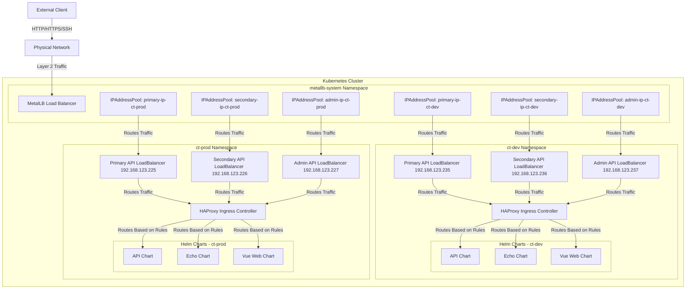
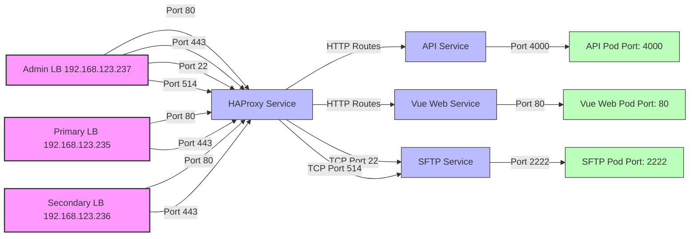

# Installing Call Telemetry with HAProxy Ingress Controller

This guide walks through the complete installation of Call Telemetry using HAProxy as the ingress controller in a Kubernetes environment. We'll cover everything from adding the necessary Helm repositories to configuring all components for a production-ready deployment.

## Prerequisites

- Kubernetes cluster (v1.30+)
- Helm 3 installed
- `kubectl` configured to communicate with your cluster
``` bash
mkdir -p ~/.kube
sudo cat /etc/rancher/k3s/k3s.yaml > ~/.kube/config
```

## Architecture Overview

The following diagram illustrates the high-level architecture of the Call Telemetry deployment with HAProxy in a Kubernetes cluster:



### Port Mapping Diagram

The following diagram illustrates how external ports on the load balancers map to internal services and pods:



The deployment consists of the following components:

1. **MetalLB** - Layer 2 load balancer for Kubernetes (bare metal)
   - Provides external IP addresses for services
   - Configured with a range of IPs for the cluster
2. **HAProxy Ingress Controller** - Routes external traffic to services
    - Configured with multiple Ingress resources for different environments
    - Handles TCP services for SFTP and Syslog
    - Uses shared RBAC resources for multi-namespace deployment
3. **NATS Server** - Message broker for inter-service communication
    - Configured with JetStream for persistent messaging
    - Deployed in both ct-dev and ct-prod namespaces
4. **PostgreSQL Database** - Data storage
5. **Call Telemetry API** - Core application services
6. **Vue Web Frontend** - User interface for Call Telemetry

## Add Required Helm Repositories

First, add all the necessary Helm repositories:

```bash
helm repo add haproxy-ingress https://haproxy-ingress.github.io/charts
helm repo add metallb https://metallb.github.io/metallb
helm repo add nats https://nats-io.github.io/k8s/helm/charts
helm repo add calltelemetry https://calltelemetry.github.io/k8s/helm/charts
helm repo update
```

## Cluster Wide Install and Configure MetalLB - Bare Metal Load Balancer

MetalLB provides external IP addresses for Kubernetes services.

```bash
helm install metallb metallb/metallb -n metallb-system
```


## Create ct-dev and ct-prod Namespace

Create dedicated namespaces for the Call Telemetry deployment Dev and Prod environments:

```bash
kubectl create namespace ct-dev
kubectl create namespace ct-prod
```

## Create Shared RBAC Resources for Multi-Namespace Deployment

When deploying HAProxy in multiple namespaces, you need to create shared RBAC resources to avoid conflicts with cluster-wide resources like ClusterRoles.

1. Use the provided `examples/haproxy-shared-rbac-narrow.yaml` file which contains:
   - A shared ClusterRole with all necessary permissions
   - ServiceAccounts for each namespace (ct-dev and ct-prod)
   - ClusterRoleBindings that grant permissions to the ServiceAccounts

2. Apply the shared RBAC resources:

```bash
kubectl apply -f examples/haproxy-shared-rbac-narrow.yaml
```

This grants the necessary permissions to the service accounts in both namespaces, so you don't need to update the RBAC configuration when deploying HAProxy in each namespace.

## Install HAProxy Ingress Controller in Multiple Namespaces

After applying the shared RBAC resources, you can install HAProxy in both namespaces. HAProxy handles ingress traffic and routes it to the appropriate services.

The example values files (`examples/haproxy-ct-dev-values.yaml` and `examples/haproxy-ct-prod-values.yaml`) include:
- Disabled RBAC creation (using the shared RBAC resources)
- Existing ServiceAccount configuration
- Namespace-specific IngressClass names
- TCP services configuration for SFTP and Syslog

```bash
# Install in ct-dev namespace
helm install haproxy-ingress haproxy-ingress/haproxy-ingress -n ct-dev -f examples/haproxy-ct-dev-values.yaml

# Install in ct-prod namespace
helm install haproxy-ingress haproxy-ingress/haproxy-ingress -n ct-prod -f examples/haproxy-ct-prod-values.yaml
```

## Install the CT Ingress Configs

Each namespace has its own Ingress configuration that routes traffic to the Call Telemetry API services. This layer allows you to configure load balancing concerns without impacting the API Service Chart.

The example values files (`examples/ingress-ct-dev-values.yaml` and `examples/ingress-ct-prod-values.yaml`) include:
- Load balancer configurations for primary, secondary, and admin APIs
- MetalLB IP address assignments
- SFTP and Syslog port configurations
- HAProxy selector configuration

```bash
# Install in ct-dev namespace
helm install ingress-haproxy helm/charts/ingress -n ct-dev -f examples/ingress-ct-dev-values.yaml

# Install in ct-prod namespace
helm install ingress-haproxy helm/charts/ingress -n ct-prod -f examples/ingress-ct-prod-values.yaml
```

## Install NATS Server

NATS is a lightweight messaging system that Call Telemetry uses for inter-service communication. The example values file (`examples/nats-values.yaml`) configures NATS with JetStream enabled for persistent messaging.

```bash
# Install in ct-dev namespace
helm install nats nats/nats -n ct-dev -f examples/nats-values.yaml

# Install in ct-prod namespace
helm install nats nats/nats -n ct-prod -f examples/nats-values.yaml
```

## Set Up PostgreSQL Database

Call Telemetry requires a PostgreSQL database for data storage. You can either use an external PostgreSQL instance or deploy one within your Kubernetes cluster.

### Option 1: Crunchy PostgreSQL


## Install Call Telemetry API

This chart deploys the Call Telemetry API and its immediate dependencies. The example values files (`examples/api-ct-dev-values.yaml` and `examples/api-ct-prod-values.yaml`) include:
- Database configuration with existing secret
- Admin service configuration with SSH port
- SFTP server configuration
- Syslog configuration

```bash
# Install in ct-dev namespace
helm install api helm/charts/api -n ct-dev -f examples/api-ct-dev-values.yaml

# Install in ct-prod namespace
helm install api helm/charts/api -n ct-prod -f examples/api-ct-prod-values.yaml
```

## Install Vue Web Frontend

The Vue Web frontend provides the user interface for Call Telemetry. The example values files (`examples/vue-web-ct-dev-values.yaml` and `examples/vue-web-ct-prod-values.yaml`) include:
- Service configuration
- Ingress configuration with HAProxy-specific annotations
- Session cookie configuration

```bash
# Install in ct-dev namespace
helm install vue-web helm/charts/vue-web -n ct-dev -f examples/vue-web-ct-dev-values.yaml

# Install in ct-prod namespace
helm install vue-web helm/charts/vue-web -n ct-prod -f examples/vue-web-ct-prod-values.yaml
```

## Verify the Installation

Check that all pods are running in both namespaces:

```bash
# Check ct-dev namespace
kubectl get pods -n ct-dev

# Check ct-prod namespace
kubectl get pods -n ct-prod
```

Verify the services and their external IPs:

```bash
# Check ct-dev namespace
kubectl get services -n ct-dev

# Check ct-prod namespace
kubectl get services -n ct-prod
```

Check the ingress resources:

```bash
# Check ct-dev namespace
kubectl get ingress -n ct-dev

# Check ct-prod namespace
kubectl get ingress -n ct-prod
```

## Testing the Deployment

Test the API endpoints using curl for both environments:

```bash
# Test the dev environment
# Test the admin API
curl -H "Host: dev.calltelemetry.com" http://192.168.123.237/api

# Test the primary API
curl -H "Host: dev.calltelemetry.com" http://192.168.123.235/api/policy

# Test the prod environment
# Test the admin API
curl -H "Host: prod.calltelemetry.com" http://192.168.123.217/api

# Test the primary API
curl -H "Host: prod.calltelemetry.com" http://192.168.123.225/api/policy
```

## Troubleshooting

### Database Connection Issues

If the API pods are having trouble connecting to the database, verify the database secret:

```bash
# For ct-dev namespace
kubectl get secret hippo-pguser-calltelemetry -n ct-dev -o jsonpath='{.data}' | jq

# For ct-prod namespace
kubectl get secret hippo-pguser-calltelemetry -n ct-prod -o jsonpath='{.data}' | jq
```

### Ingress Routing Issues

Check the HAProxy Ingress Controller logs:

```bash
# For ct-dev namespace
kubectl logs -n ct-dev -l app.kubernetes.io/name=haproxy-ingress

# For ct-prod namespace
kubectl logs -n ct-prod -l app.kubernetes.io/name=haproxy-ingress
```

### SFTP Connection Issues

If you're having trouble connecting to the SFTP server, verify that HAProxy is properly configured to forward port 22:

```bash
# Check if HAProxy is listening on port 22
kubectl exec -n ct-dev $(kubectl get pods -n ct-dev -l app.kubernetes.io/name=haproxy-ingress -o jsonpath='{.items[0].metadata.name}') -- netstat -tulpn | grep ":22"

# Check the TCP services configmap
kubectl get configmap -n ct-dev haproxy-tcp-services -o yaml
```

### Pod Startup Issues

Check the logs of the failing pods:

```bash
# For ct-dev namespace
kubectl logs -n ct-dev <pod-name>

# For ct-prod namespace
kubectl logs -n ct-prod <pod-name>
```

## Conclusion

You now have a fully functional Call Telemetry deployment with HAProxy as the ingress controller. This setup provides high availability and scalability for production environments.

For more information on customizing your deployment, refer to the Call Telemetry documentation.
